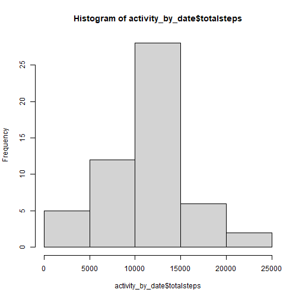
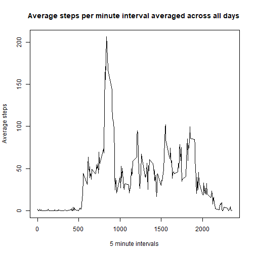
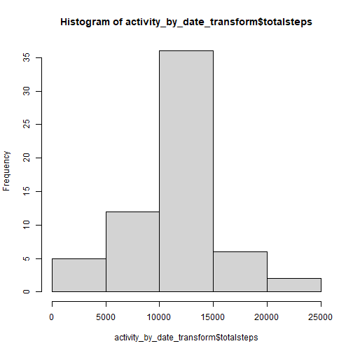
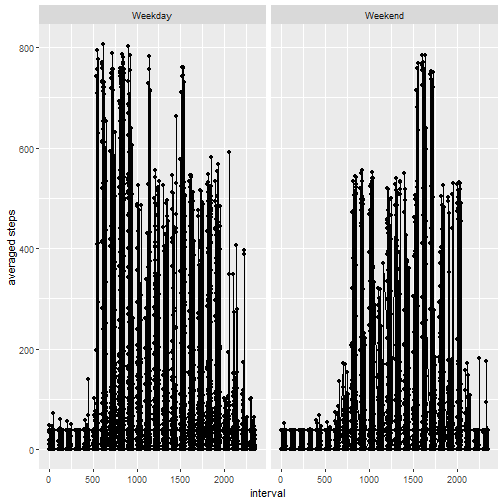

## Loading and preprocessing the data
In this step the data is extracted from the zip file and store it as a data frame with the name activity. 
Then a new data frame called activity_no_NA is created with complete cases only (no NA's in any column).

```r
f = unz(description="activity.zip",filename="activity.csv")
open(f)
activity <- read.csv(f, colClasses = c("integer", "Date", "integer"))
activity_no_NA <- activity[complete.cases(activity),]
close(f)
```

## What is mean total number of steps taken per day?

- Calculate the total number of steps taken per day. Using the dplry package, the data frame activity_no_NA was used, to group it by day and do a sum summarization of the steps. 

```r
activity_by_date <- activity_no_NA %>% select(date, steps) %>% group_by(date) %>% summarise(totalsteps = sum(steps))
```

```
## `summarise()` ungrouping output (override with `.groups` argument)
```

```r
str(activity_by_date)
```

```
## tibble [53 x 2] (S3: tbl_df/tbl/data.frame)
##  $ date      : Date[1:53], format: "2012-10-02" "2012-10-03" "2012-10-04" ...
##  $ totalsteps: int [1:53] 126 11352 12116 13294 15420 11015 12811 9900 10304 17382 ...
```

- Make a histogram of the total number of steps taken each day. Using the same data frame as in the previous question, the histogram is created using the hist function.

```r
hist(activity_by_date$totalsteps)
```



- Calculate and report the mean and median of the total number of steps taken per day. The mean is calculating using the mean function and the median using the median function, applying both to the same data frame.

```r
mean(activity_by_date$totalsteps)
```

```
## [1] 10766.19
```

```r
median(activity_by_date$totalsteps)
```

```
## [1] 10765
```

## What is the average daily activity pattern?

- Make a time series plot of the 5-minute interval (x-axis) and the average number of steps taken, averaged across all days (y-axis). For doing this step a new data frame was created based on the one without NA values. Using the select, group_by and summarise function the data was set up to plot it using the baseplot system.

```r
timeseries <- activity_no_NA %>% select(interval, steps) %>% group_by(interval) %>% summarise(average = mean(steps))
```

```
## `summarise()` ungrouping output (override with `.groups` argument)
```

```r
plot(timeseries$interval, timeseries$average, type = "l", xlab = "5 minute intervals", ylab = "Average steps", main = "Average steps per minute interval averaged across all days ")
```


- Which 5-minute interval, on average across all the days in the dataset, contains the maximum number steps? 

```r
maxaverage <- which.max(timeseries$average)
paste("Interval with the maximum value: ", timeseries$interval[maxaverage])
```

```
## [1] "Interval with the maximum value:  835"
```

```r
paste("Maximum averaged steps on the interval: ", timeseries$average[maxaverage])
```

```
## [1] "Maximum averaged steps on the interval:  206.169811320755"
```

## Imputing missing values

- Calculate and report the total number of missing values in the dataset (i.e. the total number of rows with NA's)

```r
sum(!complete.cases(activity))
```

```
## [1] 2304
```

- Devise a strategy for filling in all of the missing values in the data set. The strategy is to replace the NA values with the mean value of the total steps taken in each date.


```r
activity_transform_mean <- activity %>% mutate( replace_steps = if_else(is.na(steps), as.integer(mean(activity_no_NA$steps)), steps))
```

- Create a new dataset that is equal to the original but with the missing data filled in. The dataset created in the previous step has the NA's filed in.

```r
str(activity_transform_mean)
```

```
## 'data.frame':	17568 obs. of  4 variables:
##  $ steps        : int  NA NA NA NA NA NA NA NA NA NA ...
##  $ date         : Date, format: "2012-10-01" "2012-10-01" "2012-10-01" ...
##  $ interval     : int  0 5 10 15 20 25 30 35 40 45 ...
##  $ replace_steps: int  37 37 37 37 37 37 37 37 37 37 ...
```

- Make a histogram of the total number of steps taken each day and calculate and report the mean and median total number of steps taken per day. 
  - Do these values differ from the estimates from the first part of the assignment. The shape of the histogram is very similar. 
  - What is the impact of imputing missing data on the estimates of the total daily number of steps? The mean is very similar, the median value is lower than removing the NA's. Also it is worth noting that the peak value is higer thant the original one. 

```r
activity_by_date_transform <- activity_transform_mean %>% select(date, replace_steps) %>% group_by(date) %>% summarise(totalsteps = sum(replace_steps))
```

```
## `summarise()` ungrouping output (override with `.groups` argument)
```

```r
str(activity_by_date)
```

```
## tibble [53 x 2] (S3: tbl_df/tbl/data.frame)
##  $ date      : Date[1:53], format: "2012-10-02" "2012-10-03" "2012-10-04" ...
##  $ totalsteps: int [1:53] 126 11352 12116 13294 15420 11015 12811 9900 10304 17382 ...
```

```r
hist(activity_by_date_transform$totalsteps)
```



```r
mean(activity_by_date_transform$totalsteps)
```

```
## [1] 10751.74
```

```r
median(activity_by_date_transform$totalsteps)
```

```
## [1] 10656
```


## Are there differences in activity patterns between weekdays and weekends?

- Create a new factor variable in the dataset with two levels "weekday" and "weekend" indicating whether a given date is a weekday or weekend day. Using the mutate and the weekdays.Date functions the new variable was created in the activity_weekdays data set. Since the weekdays.Date function returns the values in the locale language the expression used will only work on laptops with Espanish as the locale language. The new variable was converted to factor with the as.factor function.

```r
activity_weekdays <- activity_transform_mean %>% mutate( weekday = if_else(is.element( weekdays.Date(date), c("sábado", "domingo")), "Weekend", "Weekday"))
activity_weekdays$weekday <- as.factor(activity_weekdays$weekday)
```

- Make a panel plot containing a time series plot of the 5-minute interval (x-axis) and the average number of steps taken, averaged across all weekday days or weekend days (y-axis). The plot was created using the ggplot system with the qplot function. 

```r
qplot(interval, replace_steps, data = activity_weekdays, facets = . ~ weekday, ylab = "averaged steps") + geom_line()
```


